# WorkOut
Node.js and MongoDB backend fitness iOS app that allows users to create custom interval training workouts.

## Screenshots
### Creating Exercises
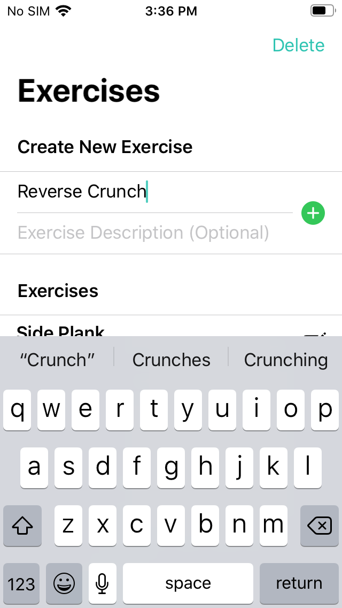 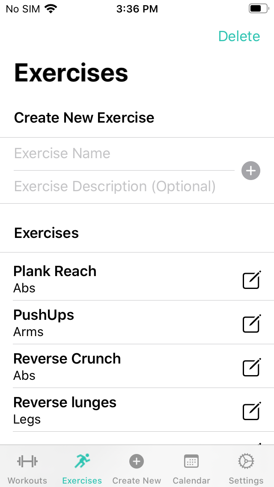 
### Creating A Workout
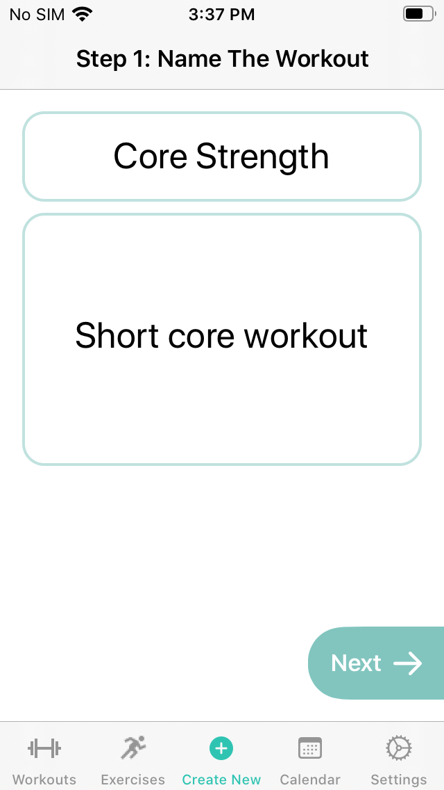 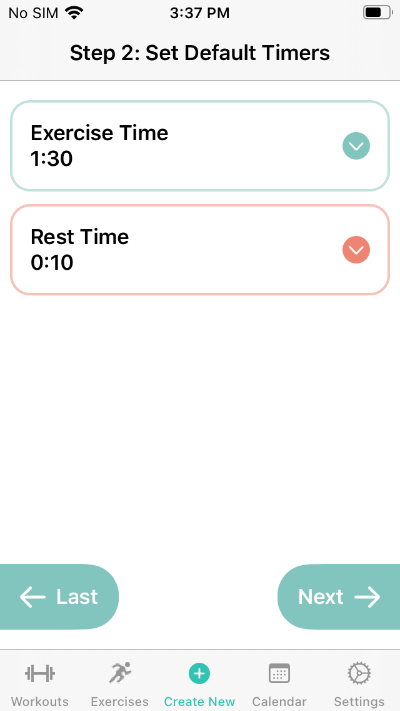 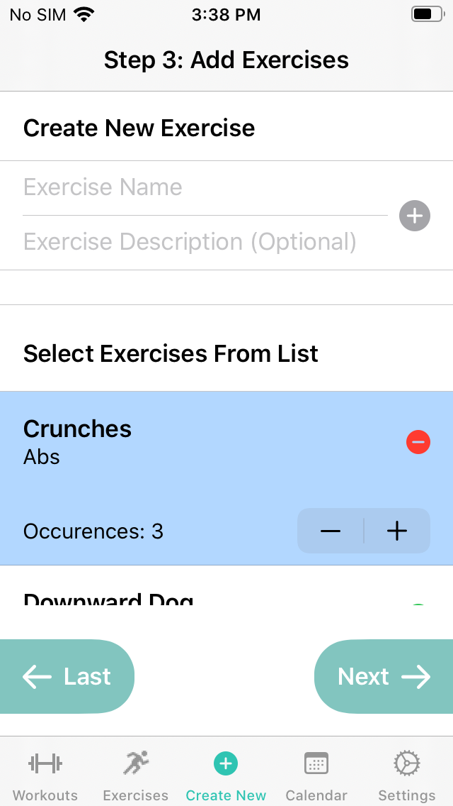 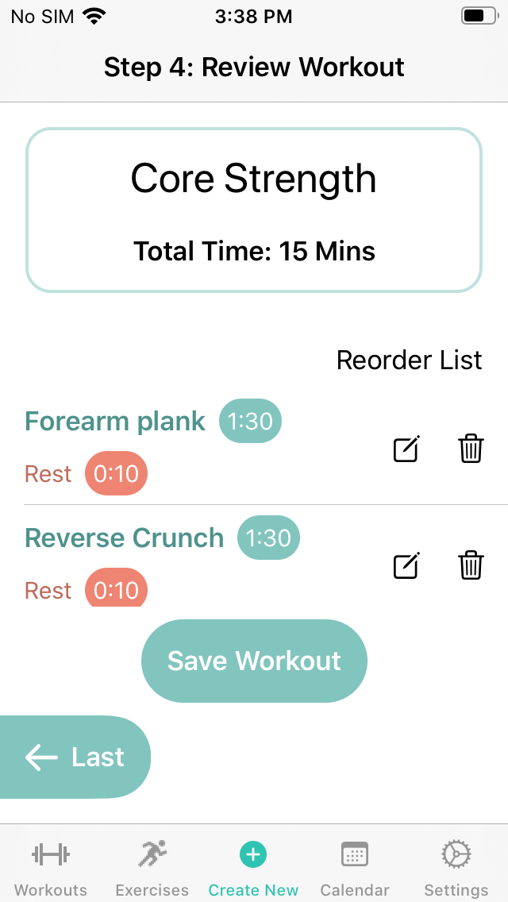
### Starting A Workout
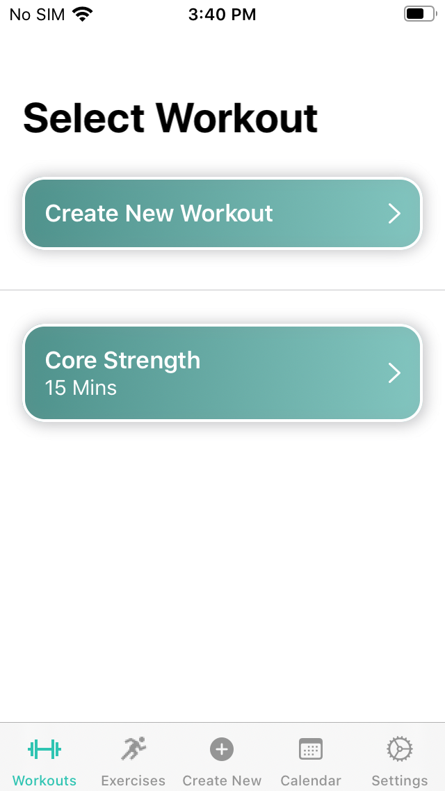 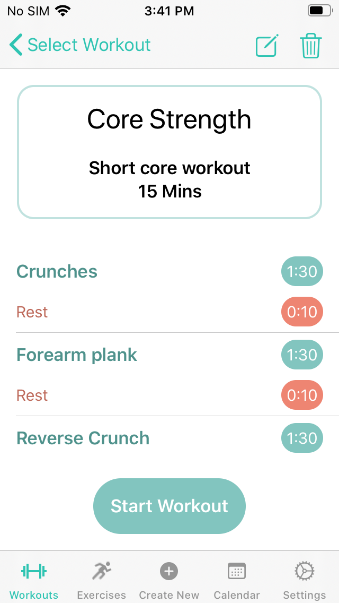 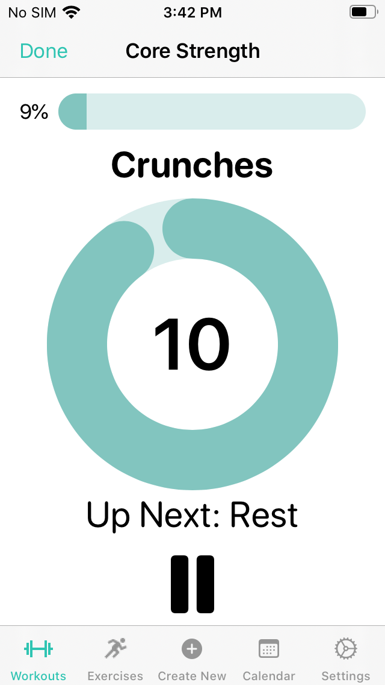 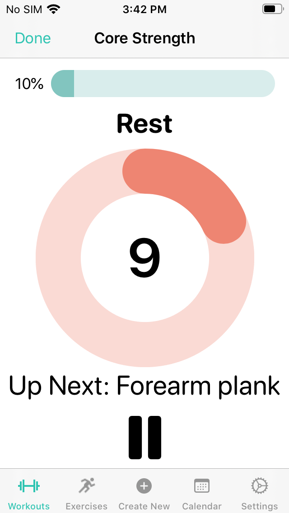
### Configuring Settings
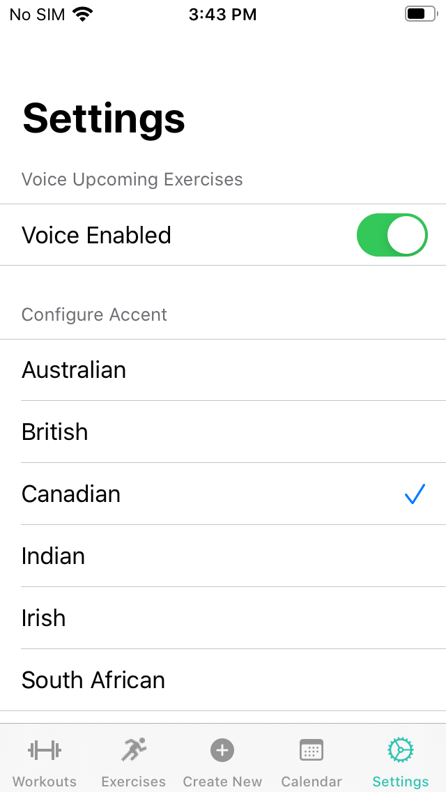 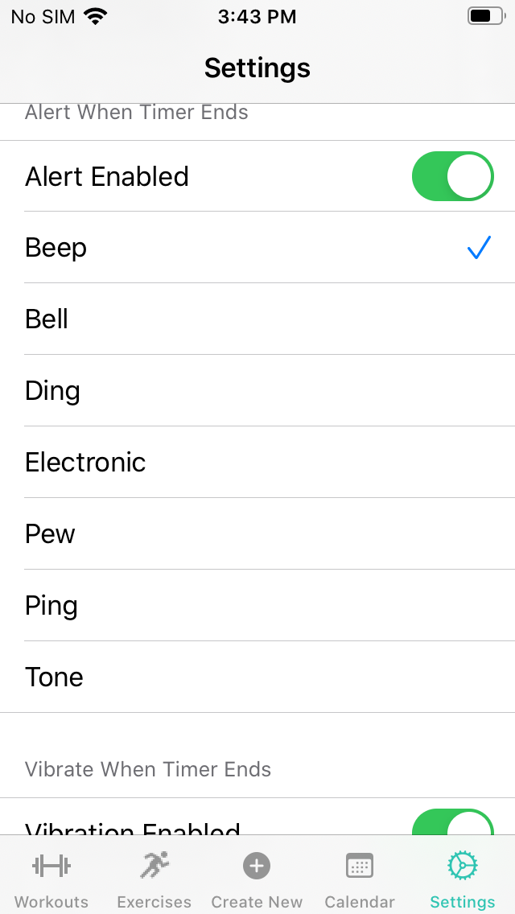 
### Scheduling A Workout
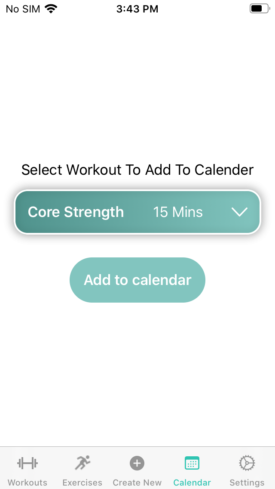

## Motivation
Found myself getting bored after repeatedly watching the same YouTube workout videos. Wanted to be able to choose different exercises and play my own music in the background. Decided to create an app where I could personalize my workouts. 

## Features
* Can create and add exercises to a workout specifying the length of time to perform the exercise and optionally add a rest time
*	Visual progress bar
*	Option to add voice to read the name of the upcoming workout
*	Option to add sound and/or haptics to indicate the start and end of an exercise
*	Ability to schedule a workout in the iOS calendar 

## Future Improvement
* Need to add the ability to cache workouts that have been created. This way the app can be used offline. As it is, if there is no access to the server, previously create workouts will not appear when the app is first opened.
